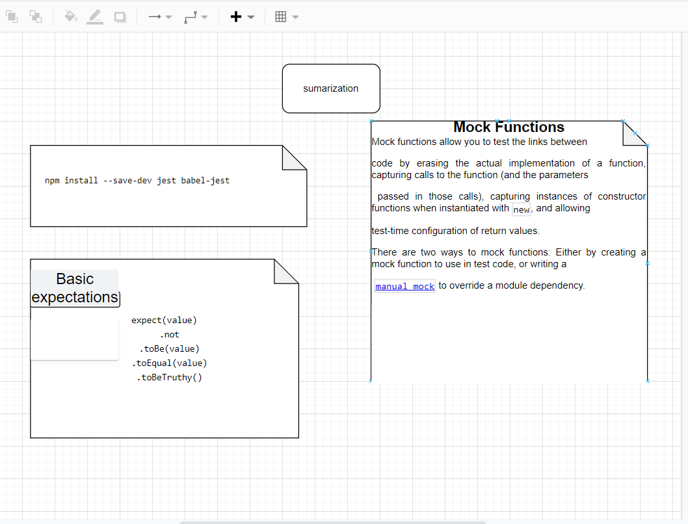

# basic-express-server

1-How do I install the app or library? npm install (name of library ) 2-How do I test the app or library? run this commend npm test in ubuntu

.env requirements
PORT - 3000

{ "domain": "https://raneem-bassic-express-dev.herokuapp.com/home", , "status": "running", "port": 3030 }

For Applications:
How do I run the app? npm run dev

How do I set up the app? from the package.json
[action](https://github.com/raneemabujamous/basic-express-server/actions)
[pull request](https://github.com/raneemabujamous/basic-express-server/tree/dev)

sumrization

